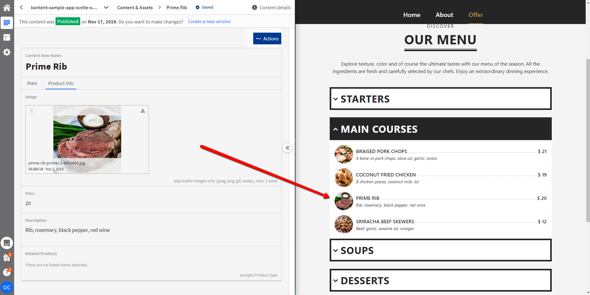

# Build a Website on a Headless CMS with Svelte

Working repository for based on [ReactiveConf 2019][reactive] workshop repository. The goal is to showcase a website for fictional café with [Svelte][svelte], [Sapper][sapper], and [Kentico Kontent][kontent]. The result can be deployed to [ZEIT][zeit].


## Prerequisites

- Node 10+
- npm 6+
- now

## Getting started

1. Clone the repository

    ```sh
    git clone https://github.com/Simply007/kontent-sample-app-svelte-sapper
    ```

1. Install the packages

    ```sh
    npm install
    ```

1. [Register on Kentico Kontent](http://app.kontent.ai)
1. [Create an empty project](https://docs.kontent.ai/tutorials/set-up-projects/manage-projects/creating-and-archiving-projects)
1. [Enable Content Management API](https://docs.kontent.ai/tutorials/set-up-projects/migrate-content/importing-to-kentico-kontent#a-enabling-the-api-for-your-project)
1. Import [content.zip](/content.zip) data using [Template manager](https://kentico.github.io/kontent-template-manager/import-from-file)
    * Use `Project Id` and `Content Management API key` from previously generated project.
1. Place the `PROJECT_ID` to the  [`src/cms.js`](src/cms.js#L3) configuration file.
1. Run development environment

   ```sh
   npm run dev
   ```

🚀 Your site is now running at http://localhost:3000!

## Functionality

### Kontent.

Most of the content on the site is hard-coded. If you navigate to `/offer` section the food data and it's categories is stored [Kentico Kontent][kontent].



### Deployment

Deployment could be performed using [ZEIT][zeit]'s Now which is fully [integrated GitHub](https://zeit.co/docs/v2/more/now-for-github).

#### Build

Build is perfomed in two steps, first you run `npm run build` and then `npm run export`. For more info visit [Sapper documentation](https://sapper.svelte.dev/docs/).

### Prettier

If you run `npm run prettier`, the source code is formatted using [Prettier](https://prettier.io/).

### Cypress (end-to-end testing)

If you run `npm run test`, it will run end-to-end tests defined in `/cypress` folder.

## Thanks

  [Original project](https://github.com/Socialbakers/reactiveconf-sapper-workshop) was based on [now-sapper-demo](https://github.com/beyonk-adventures/now-sapper-demo) by [@antony](https://github.com/antony) and then showcased on [Reactive Conference 2019][reactive] in Prague on the workshop from [Social Bakers](https://www.socialbakers.com/) by [Jan Vlnas](https://github.com/jnv).

[sapper]: https://sapper.svelte.dev/
[svelte]: https://svelte.dev/
[kontent]: https://kontent.ai/
[zeit]: https://zeit.co/
[reactive]: https://reactiveconf.com/
